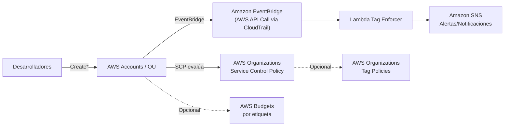

# Jaguar FinOps — Tagging guardrails from day‑zero
**Objetivo:** garantizar que *toda* carga en AWS nazca con etiquetas FinOps correctas y que los costos puedan atribuirse desde el día 1.

**Pilares del proyecto**
- **Guardrails en AWS Organizations (SCP)**: niega creaciones sin etiquetas requeridas (para servicios compatibles con tagging‑on‑create).
- **(Opcional) Tag Policies**: normaliza claves/valores de etiquetas a nivel organización.
- **EventBridge + Lambda (Tag Enforcer)**: inspecciona creaciones vía CloudTrail; aplica tags por defecto y/o notifica por **SNS**.
- **Presupuestos (Budgets) por etiqueta** *(opcional)*: alertas por `CostCenter`, `Environment`, etc.
- **CI/CD**: workflow de GitHub Actions para `cdk synth`/`deploy` con OIDC.

> ⚠️ **Importante**: Para administrar **Organizations** debes desplegar en la **cuenta de administración** (management account). Muchas operaciones requieren `us-east-1` por ser servicios globales (ver notas en cada stack). Prueba siempre en una **OU de sandbox** antes de aplicar a toda la organización.

---

## Arquitectura

```text
Desarrolladores ──(Create*)──> Cuentas/OU
        │
        │  A) SERVICE CONTROL POLICY (SCP) en AWS Organizations
        │     └─ Deny si faltan tags requeridas (Owner, Environment, CostCenter, Application)
        │
        │  B) EventBridge (AWS API Call via CloudTrail)
        │     └─ Lambda Tag Enforcer
        │            ├─ Aplica tags por defecto (opt‑in)
        │            └─ Publica en SNS alertas de incumplimiento
        │
        │  C) (Opcional) Tag Policies en Organizations
        │     └─ Normaliza claves/valores
        │
        └─ (Opcional) AWS Budgets por etiqueta → Alertas (Email/Slack)
```

### Diagrama Mermaid


---

## Estructura
```text
jaguar-finops/
├─ README.md
├─ cdk/
│  ├─ package.json
│  ├─ tsconfig.json
│  ├─ cdk.json
│  ├─ bin/
│  │  └─ jaguar-finops.ts
│  └─ lib/
│     ├─ scp-guardrails-stack.ts         # SCP que exige tags al crear recursos
│     ├─ tag-enforcer-stack.ts           # EventBridge + Lambda + SNS
│     └─ budgets-stack.ts                # (Opcional) Budgets por etiqueta
├─ lambda/
│  └─ tag_enforcer/
│     ├─ app.py                          # Lógica de verificación/aplicación de tags
│     └─ requirements.txt
├─ policies/
│  ├─ scp-require-tags.json              # Ejemplo de política para SCP
│  └─ tag-policy-example.json            # Plantilla de Tag Policy (no se despliega por defecto)
├─ docs/
│  ├─ architecture.mmd
│  └─ architecture.png
└─ .github/
   └─ workflows/
      └─ cdk-deploy.yml
```

---

## Requerimientos
- **Node 18+**, **AWS CDK v2**, **Python 3.11** (para la Lambda).
- Permisos: cuenta de **management** para desplegar **SCP** (Organizations). Para el *enforcer* basta una cuenta miembro.

## Despliegue rápido
```bash
cd cdk
npm ci || npm install
npm run build

# Bootstrap (ajusta cuenta/region); para Organizations usa us-east-1
npx cdk bootstrap aws://<ACCOUNT_ID>/us-east-1

# Desplegar stacks (puedes elegir solo uno)
npx cdk deploy JaguarFinops-SCP
npx cdk deploy JaguarFinops-TagEnforcer
npx cdk deploy JaguarFinops-Budgets    # opcional
```

### Variables del Tag Enforcer (Lambda)
Configura en `tag-enforcer-stack.ts` o como **env vars** de la función:
- `REQUIRED_TAG_KEYS` (CSV): `Owner,Environment,CostCenter,Application`
- `DEFAULT_TAGS_JSON`: `{"Environment":"sandbox"}`
- `ALLOWED_ENV_VALUES` (CSV): `prod,staging,dev,sandbox`
